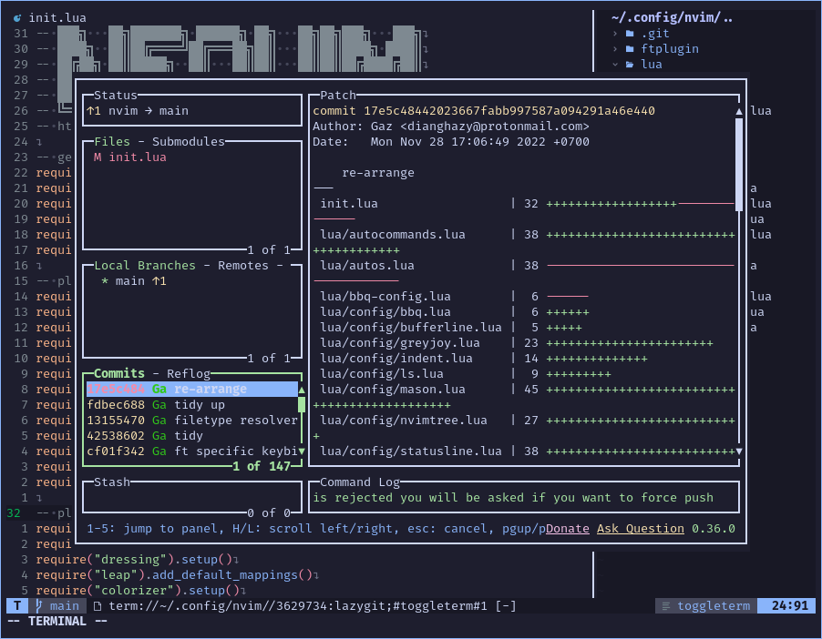

# My Simple Neovim Configuration

This repos hosts my nvim configuration for Linux. Specific plugins configurations are stored in the `lua/config/` directory. While general configurations, like keybindings, color scheme, nvim options and the like, are stored in the `lua/` directory. All default plugin setups are called directly in the `init.lua` file.

This configuration is mainly setup for `Python`, `Svelte`, `Lua`, and `Go`.

# Installation

Just clone or link the `nvim` directory to your `$XDG_CONFIG_HOME` and run `PackerSync`.

# Features

Very rudimentary filetype specific code runner based on `ftplugin` and `whichkey`. For more complex commands create a `Makefile` (that's what I use) in the root directory (where `.git` is) and launch [Greyjoy](https://github.com/desdic/greyjoy.nvim/) by pressing `<leader>l`*.

* `<leader>` is `space`

Catppuccin colorscheme.

List of plugins used can be seen at `lua/plugins.lua`.

# Screenshots

